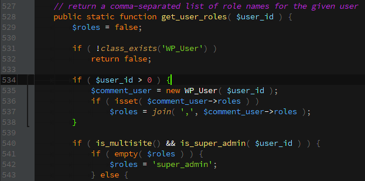

Color Scheme
===

## Rules

Component | Color | HEX Color
---|---|---
Background |  | `#171717`
Keyword / Tag |  | `#FF8019`
Comment |  | `#B729D9`
String |  | `#7BD128`
Number |  | `#EE5B6C`
Global Variable / Constant |  | `#446CFF`
Local Variable |  | `#4AA3FF`
Argument Variable |  | `#77DAFF`
Function / Method / Attribute |  | `#F4DC6E`
Braces / Parentheses / Brackets |  | `#999999`
Caret |  | `#FFFFFF`
Caret row |  | `#101010`
TODO/FIXME |  | `#FF0000`

## IDE

* [PhpStorm](phpstorm)
* [CLion](clion)
* [Sublime Text](sublime-text)
