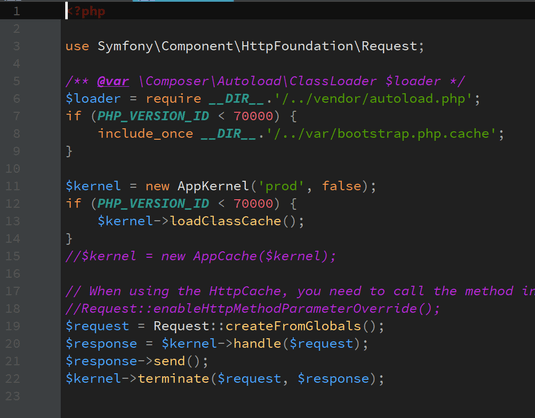
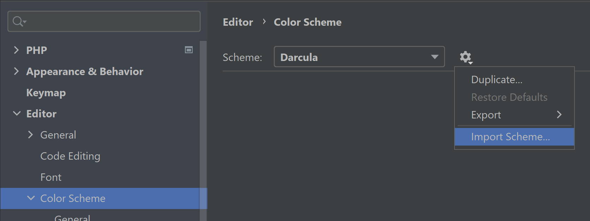

# Color Scheme

For [JetBrains IDE](https://www.jetbrains.com/products/#type=ide) _(IntelliJ IDEA, CLion, PhpStorm, WebStorm, etc.)_

## Preview

* C++
    

Screenshot
  

* PHP
    

Screenshot
  

## Usage

1. [Download the `.icls` file](https://github.com/01e9/color-scheme/raw/master/moldcraft.icls)
2. Import it
    

IDE settings
  

