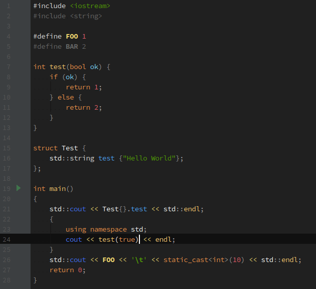

# Color Scheme

For JetBrains IDEs: CLion, PHPStorm, WebStorm, etc.

### C++

### PHP

## Rules

Component | Color | HEX Color
---|---|---
Background |  | `black light`
String |  | `green`
Keyword / Tag |  | `orange`
Function / Method / Attribute |  | `yellow`
Comment |  | `pink dark`
Number |  | `red light`
Global Variable / Constant |  | `blue dark`
Local Variable |  | `blue`
Argument Variable |  | `blue light`
Braces / Parentheses / Brackets |  | `gray`
Caret |  | `white`
Caret row |  | `black`
TODO/FIXME |  | `red`

## Usage

* `git clone https://github.com/moldcraft/color-scheme.git`
* `cd color-scheme`
* `mkdir -p ~/.YOUR_IDE/config/colors`
* `ln -s $(pwd)/moldcraft.icls ~/.YOUR_IDE/config/colors/`
