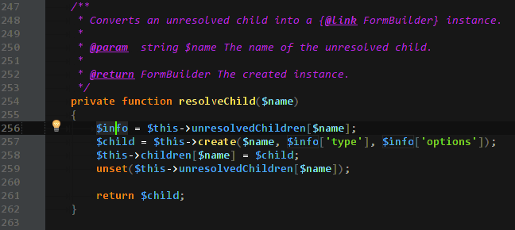

PhpStorm Theme
===

## Rules

Component | Color
---|---
Background | dark gray
Keywords | orange
Comments | violet
Strings | green
Global Variable | dark blue
Local Variable | blue
Argument Variable | light blue
Functions/Methods | dark yellow
Caret | `#00FF00`
TODO/FIXME | `#FF0000`

## How To Install

### [Download](moldcraft.icls) the theme file

### Copy the file to the themes directory

_PHPStorm version 7.x_

* __Ubuntu/Linux__ `~/.WebIde70/config/colors`
* __Mac OS X__ `~/Library/Preferences/WebIde70/colors/`
* __Windows__ `C:/Users/USERNAME/.WebIde70/config/colors`

### Enable the theme

1. Go to: `Settings` -> `Editor` -> `Colors & Fonts`
2. Select the cheme name `moldcraft` and click OK
3. Restart PhpStorm

