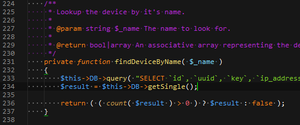

Sublime Text Color Scheme
===

Unfortunately, due to the way in which Sublime's scope processing works, it is impossible for parameters to be coloured differently throughout a function's code, they can only be treated as such in the declaration.

# Install

1. [Download](https://raw.githubusercontent.com/moldcraft/colour-scheme/master/sublime-text/moldcraft.tmTheme) the file

    `Right Click` -> `Save As`
* Copy the file in packages directory

    You can find it by using the `Preferences` -> `Browse Packages...` menu
* Enable the scheme

    Go to menu `Preferences` -> `Color Scheme` -> `moldcraft`

# To Do

* Try to get characters `()[]` (and `{}`?) to be a slight grey rather than white or whatever
